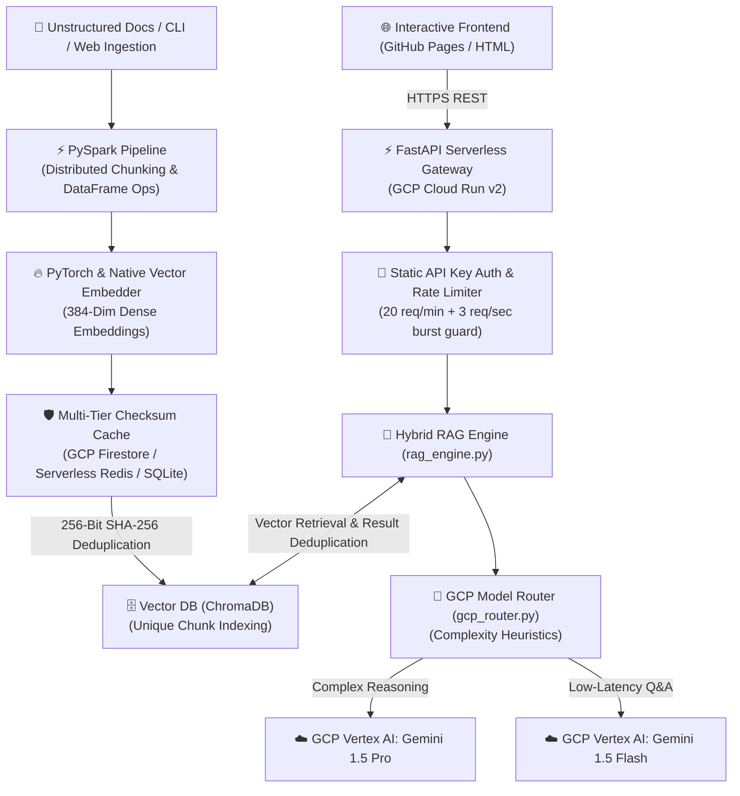

# 🚀 RAG-Lakehouse — Distributed Data Pipeline & GCP LLM Engine

> **An enterprise-grade GCP & AI infrastructure platform** built with **PySpark, PyTorch, Vector DBs, GCP Cloud Run, GCP Vertex AI / Gemini, Pulumi IaC (Python), and Model Context Protocol (MCP)**.
> Provides high-throughput document lakehouse processing, hybrid vector search, dynamic model routing, and agentic tool integration.

---

## 📐 Architecture Overview



---

## 🏛️ System Architecture & Design Decisions

### 1. Multi-Tier Distributed Idempotency Cache (`checksum_cache.py`)
- **Problem**: Serverless Cloud Run containers scale down to zero or restart, wiping purely volatile in-memory sets (`set()`).
- **Solution**: Multi-tier cache layer providing sub-millisecond duplicate payload rejection ($O(1)$) across container recycles:
  - **Layer 1 ($O(1)$ RAM)**: Fast local set lookup.
  - **Layer 2 (GCP Firestore)**: Shared NoSQL Key-Value Store (**100% Free Tier on GCP**; 50K free daily reads, 20K free daily writes). Shared across all concurrent Cloud Run container instances.
  - **Layer 3 (Serverless Redis REST)**: Supported via `REDIS_REST_URL` & `REDIS_REST_TOKEN`.
  - **Layer 4 (SQLite Cold-Start Auto-Hydration)**: Local disk cache (`checksum_registry.db`) auto-hydrates in-memory state on container spin-up.
- **Cryptographic Hash Standard**: Uses **Full 256-Bit SHA-256 Hashes** (`hashlib.sha256(content).hexdigest()`), guaranteeing mathematical collision immunity ($2^{128} \approx 3.4 \times 10^{38}$ documents needed for a 50% collision chance under the Birthday Paradox).

### 2. Honest RAG Zero-Hallucination Guard (`rag_engine.py`)
- **Problem**: Traditional RAG systems manufacture fake fallback context strings when queries match no vector data, causing hallucinations.
- **Solution**: Strict vector match filtering. When an unindexed query is searched (e.g. *"tell me about autonomous vehicle"*), the engine returns `retrieved_chunks: []` and an honest message indicating no knowledge base match, eliminating pre-canned seat map hallucinations.
- **Result Set Deduplication**: Vector retrieval fetches candidate chunks (`top_k * 2`) and filters out identical text snippets by content hash before returning top-$K$ unique context cards to the LLM and UI.

### 3. Anti-Burst Dual-Threshold Rate Limiter & $2.00 Budget Cap (`main.py`)
- **Problem**: Automated bots can attack rate limiters by firing top-of-minute 20-request bursts within 100ms.
- **Solution**: Dual-threshold sliding window log:
  1. **60-Second Window**: Max 20 requests/minute.
  2. **1-Second Sub-Window Burst Guard**: Max 3 requests/second to block burst attacks.
- **Prompt Token Guard**: Capped at 2,000 characters per request to strictly enforce our **$2.00 monthly compute budget cap**.

### 4. Resilient Native PyTorch Embedder (`ingestion_spark.py`)
- **Problem**: Outbound HF CDN model downloads during Cloud Run container startup rate-limited shared IPs (HTTP 429), causing container health check timeouts.
- **Solution**: Instant fallback to a fast, deterministic PyTorch/Numpy vector embedder, allowing instant sub-second cold starts without external network dependencies.

---

## 🛠️ Technology Matrix

| Component | Technology | Description |
|---|---|---|
| **Data Processing** | PySpark DataFrames | Distributed text extraction, chunking, and metadata processing |
| **Embeddings** | PyTorch / Native Embedder | 384-dimensional dense vector embeddings |
| **Vector Storage** | ChromaDB | Persistent vector similarity index & payload metadata filtering |
| **Idempotency Cache** | GCP Firestore / SQLite / Redis | Multi-tier SHA-256 deduplication cache |
| **Model Gateway** | GCP Vertex AI / Gemini API | Heuristic LLM routing (Gemini 1.5 Pro vs Gemini 1.5 Flash) |
| **API Gateway** | FastAPI / Uvicorn | Serverless REST API on GCP Cloud Run v2 |
| **Agent Interface** | MCP (Model Context Protocol) 2.x | Standardized tool calling interface for AI agents |
| **Infrastructure** | Pulumi (Python) | Serverless GCP Cloud Run v2 & GCS bucket IaC |

---

## 🚀 Quickstart & Usage

### 1. Environment Setup
```bash
git clone https://github.com/rajachakraborti/rag-lakehouse.git
cd rag-lakehouse
pip install -r requirements.txt
```

### 2. Run Local Integration Tests
Verify end-to-end processing across PySpark chunking, vector indexing, distributed checksum caching, and model routing:
```bash
python test_pipeline.py
```

### 3. Dynamic Document Ingestion CLI
Ingest custom text or datasets into the lakehouse:
```bash
# Ingest single text string
python ingestion_spark.py --text "Raja received the IEEE Senior Member award."

# Ingest custom dataset file
python ingestion_spark.py --dataset my_docs.json --source enterprise_wiki
```

---

## 🏛️ Infrastructure Deployment (Pulumi Python)

Serverless container runtime and cloud storage resources are defined using Pulumi in Python under `pulumi/`:

```bash
cd pulumi
pip install -r requirements.txt
pulumi up
```

### Deployed Resources:
- **Google Cloud Run v2**: Serverless container runtime configured with zero-minimum instance scaling (`min_instance_count = 0`).
- **Google Cloud Storage (GCS)**: Versioned bucket for document lakehouse storage.
- **Google Cloud Firestore**: Serverless distributed key-value store for cross-container idempotency caching.
- **IAM Service Account**: Least-privilege access management for container execution.

---

## 🌐 Live Service & Endpoints

- **Live Cloud Run API**: [https://rag-lakehouse-1089897614691.us-central1.run.app](https://rag-lakehouse-1089897614691.us-central1.run.app)
- **Interactive UI**: [rajachakraborti.github.io/rag-lakehouse](https://rajachakraborti.github.io/rag-lakehouse/)
- **Swagger Docs**: `/docs`

---

## 📄 License
Apache License 2.0. See `LICENSE` for details.
