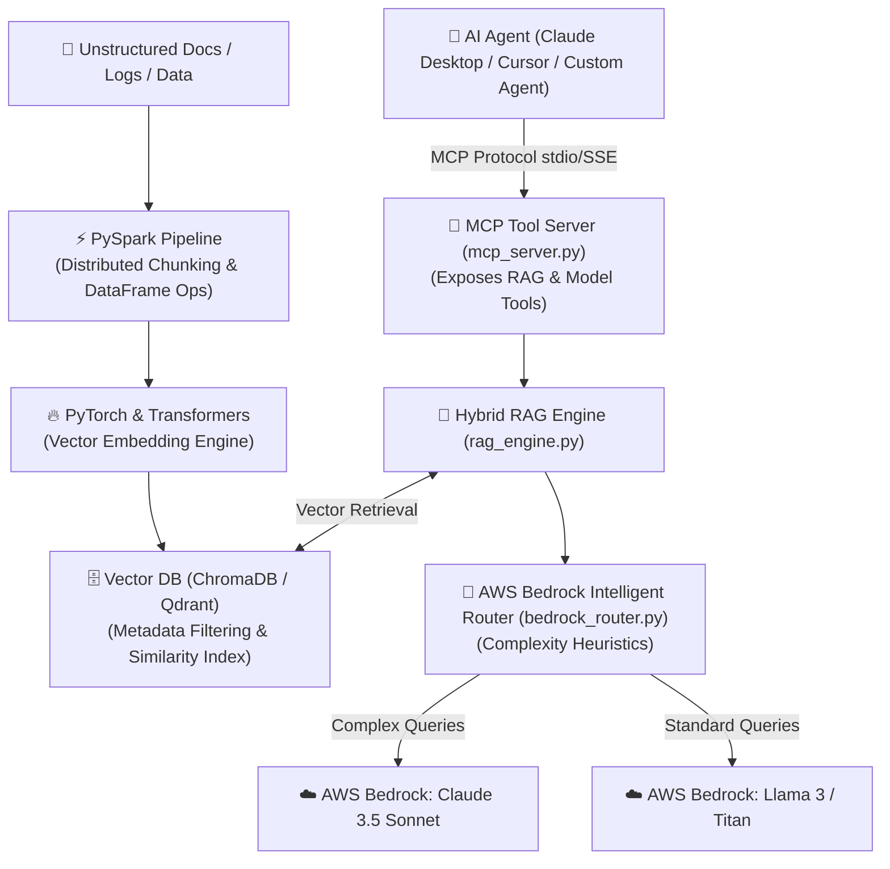

# 🚀 RAG-Lakehouse — AI Engine, Model Router & Data Pipeline

> **An enterprise-grade, multi-model AI platform** built with **PySpark, PyTorch, Vector DBs, AWS Bedrock, RAG, and Model Context Protocol (MCP)**.
> Demonstrates end-to-end data lakehouse processing, hybrid vector search, dynamic model routing, and agentic tool integration.

---

## 🔒 Security & Open GitHub Safeguards

This repository is designed to be **100% open on GitHub with zero secret leak risk**:
1. **Zero Hardcoded Secrets:** All AWS keys, model IDs, and database paths are loaded via environment variables (`.env`). `.env` is explicitly ignored in `.gitignore`.
2. **`.env.example` Template:** Provided as a dummy configuration for quick setup.
3. **Safe Mock Bedrock Mode:** If no AWS credentials exist in the environment, the engine automatically enters **Mock Bedrock Mode** — allowing integration tests to execute completely without requiring an active AWS subscription or credentials.

---

## 📐 Platform Architecture



---

## 🛠️ Technology Stack & Role Breakdown

| Technology | Architectural Role |
|---|---|
| **PySpark** | **Distributed Ingestion:** Parallelizes text extraction, chunking, and metadata mapping across Spark DataFrames for large document volumes. |
| **PyTorch** | **Compute Engine:** Generates high-dimensional vector embeddings (`sentence-transformers`) utilizing available GPU/MPS/CPU compute hardware. |
| **Vector DB (ChromaDB)** | **Persistent Storage:** Indexes vector embeddings with metadata payload filtering for sub-50ms hybrid retrieval. |
| **Hybrid RAG Engine** | **Context Retrieval:** Combines vector similarity scoring with metadata filtering and formats context for LLM synthesis. |
| **AWS Bedrock Router** | **Intelligent Model Selection:** Evaluates query complexity and dynamically routes prompts between Claude 3.5 Sonnet (complex reasoning) and Llama 3 / Titan (fast Q&A). |
| **Model Context Protocol (MCP)** | **Agentic Tool Server:** Exposes RAG search, document ingestion, and Bedrock routing as standard MCP tools for AI agents. |

---

## 🚀 Quickstart & Setup Guide

### 1. Environment Setup
Clone the repository and install dependencies:

```bash
git clone https://github.com/rajachakraborti/rag-lakehouse.git
cd rag-lakehouse
pip install -r requirements.txt
```

### 2. Configure Environment Variables (Optional)
Copy `.env.example` to `.env`:

```bash
cp .env.example .env
```
*(If you leave `.env` empty or omit AWS keys, the engine automatically runs in **Mock Bedrock Mode**.)*

### 3. Run Automated Integration Tests
Run the test suite verifying Spark chunking, PyTorch indexing, Bedrock routing, and MCP tools:

```bash
python test_pipeline.py
```

### 4. Connect to Claude Desktop / Cursor via MCP
Add the server to your `claude_desktop_config.json`:

```json
{
  "mcpServers": {
    "rag-lakehouse": {
      "command": "python",
      "args": [
        "C:/Users/rajac/interview-prep/pet_projects/rag-lakehouse/mcp_server.py"
      ]
    }
  }
}
```

---

## 🗣️ Senior / Lead AI Engineering Interview Talking Points

- **Big Data + AI Bridge:** *"I built an ingestion pipeline using PySpark for parallel text processing and chunking, bridging distributed data engineering with PyTorch vector embeddings and ChromaDB indexing."*
- **Cost & Latency Routing:** *"Rather than sending all RAG queries to high-cost models, I built an AWS Bedrock router that evaluates prompt complexity heuristics, routing multi-step code/architecture queries to Claude 3.5 Sonnet and simple lookups to Llama 3."*
- **MCP Tool Governance:** *"Exposed the entire platform as a Model Context Protocol (MCP) server, allowing AI agents to trigger PySpark ingestion and query the vector lakehouse natively via standardized tool calls."*
- **Production Safety:** *"Engineered the codebase with zero hardcoded credentials and an automatic Mock Bedrock fallback mode for safe open-source collaboration and CI/CD testing."*
