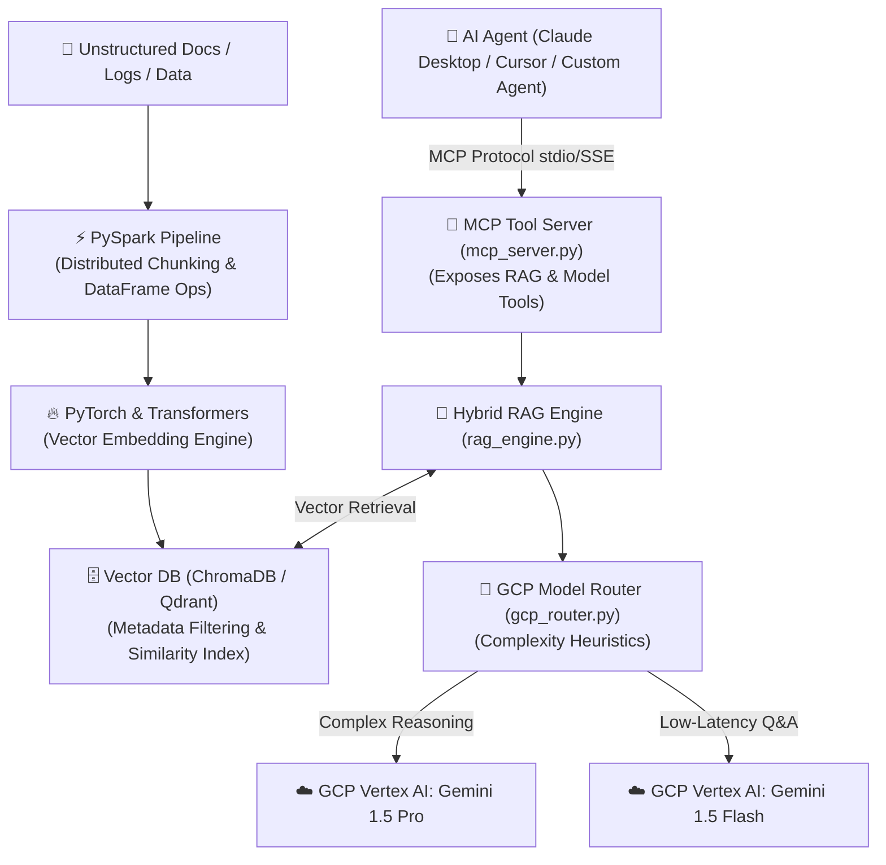

# 🚀 RAG-Lakehouse — Distributed Data Pipeline & GCP LLM Engine

> **An enterprise-grade GCP & AI infrastructure platform** built with **PySpark, PyTorch, Vector DBs, GCP Cloud Run, GCP Vertex AI / Gemini, Pulumi IaC (Python), and Model Context Protocol (MCP)**.
> Provides high-throughput document lakehouse processing, hybrid vector search, dynamic model routing, and agentic tool integration.

---

## 📐 Architecture Overview



---

## 🔑 Key Features

- **Distributed Data Ingestion:** Uses PySpark DataFrames for parallel text extraction, chunking, and metadata mapping across large document volumes.
- **PyTorch Vector Embeddings:** Computes high-dimensional vector representations utilizing local hardware acceleration (CUDA GPU, MPS, or CPU).
- **Hybrid Vector Search:** Combines vector similarity scoring with structured metadata filtering in persistent vector storage.
- **GCP Intelligent Model Router:** Dynamically routes queries between Gemini 1.5 Pro (complex reasoning) and Gemini 1.5 Flash (low-latency Q&A) based on prompt complexity heuristics to optimize latency and token cost.
- **Native MCP Tool Server (`mcp_server.py`):** Exposes search, ingestion, and routing tools directly to AI agents over standard Model Context Protocol.
- **Python-Native IaC (`pulumi/`):** Provisions serverless GCP Cloud Run v2 container instances, Google Cloud Storage buckets, and least-privilege IAM roles using Pulumi in Python.

---

## 🛠️ Technology Matrix

| Component | Technology | Description |
|---|---|---|
| **Data Processing** | PySpark | Distributed DataFrame transformation & text chunking |
| **Embeddings** | PyTorch / Sentence-Transformers | 384-dim dense vector computation |
| **Vector Index** | ChromaDB / Qdrant | Persistent vector similarity index & payload filtering |
| **Model Gateway** | GCP Vertex AI / Gemini API | Heuristic LLM routing (Gemini 1.5 Pro vs Gemini 1.5 Flash) |
| **Agent Interface** | MCP (Model Context Protocol) 2.x | Standardized tool calling interface for AI agents |
| **Infrastructure** | Pulumi (Python) | Serverless GCP Cloud Run v2 & GCS bucket IaC |

---

## 🚀 Quickstart & Setup Guide

### 1. Environment Setup
Clone the repository and install required dependencies:

```bash
git clone https://github.com/rajachakraborti/rag-lakehouse.git
cd rag-lakehouse
pip install -r requirements.txt
```

### 2. Environment Configuration
Copy `.env.example` to `.env` and set your GCP configuration:

```bash
cp .env.example .env
```

### 3. Run Automated Integration Tests
Verify end-to-end processing across PySpark chunking, vector indexing, routing heuristics, and MCP tools:

```bash
python test_pipeline.py
```

---

## 🏛️ Infrastructure Deployment (Pulumi Python)

The container runtime and cloud storage resources are defined using Pulumi in Python under `pulumi/`:

```bash
cd pulumi
pip install -r requirements.txt
pulumi up
```

### Deployed Resources:
- **Google Cloud Run v2**: Serverless container runtime configured with zero-minimum instance scaling (`min_instance_count = 0`).
- **Google Cloud Storage (GCS)**: Versioned bucket for document lakehouse storage.
- **IAM Service Account**: Least-privilege access management for container execution.

---

## 🔌 Connecting as an MCP Tool Server

Add the server definition to your agent configuration (e.g. `claude_desktop_config.json`):

```json
{
  "mcpServers": {
    "rag-lakehouse": {
      "command": "python",
      "args": [
        "C:/Users/rajac/interview-prep/pet_projects/rag-lakehouse/mcp_server.py"
      ]
    }
  }
}
```

---

## 📄 License
Apache License 2.0. See `LICENSE` for details.
